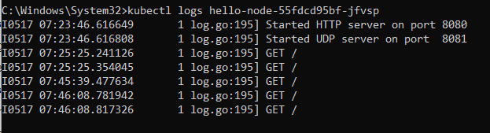
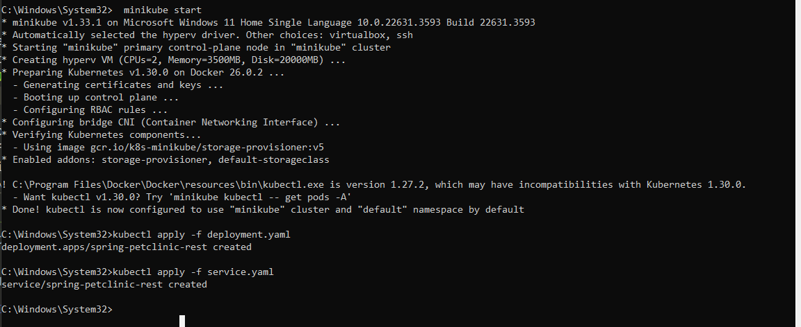
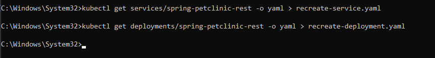

### Reflection on Hello Minikube

1. Compare the application logs before and after you exposed it as a Service.
Try to open the app several times while the proxy into the Service is running.
What do you see in the logs? Does the number of logs increase each time you open the app?

    #### Jawab:
    Sebelum aplikasi diekspos sebagai Service, log yang dihasilkan terutama berasal dari pod aplikasi itu sendiri, mencakup pesan startup, penanganan permintaan HTTP, dan pesan kesalahan. 
    
    Ya, jumlah log akan bertambah setiap kali aplikasi dibuka karena setiap akses melalui Service menghasilkan permintaan baru yang dicatat oleh aplikasi.

2. Notice that there are two versions of `kubectl get` invocation during this tutorial section.
The first does not have any option, while the latter has `-n` option with value set to `kube-system`.
What is the purpose of the `-n` option and why did the output not list the pods/services that you explicitly created?

    #### Jawab:
    Ketika Kita menggunakan perintah kubectl get tanpa opsi -n, perintah ini akan default ke namespace default, menampilkan sumber daya di namespace tersebut. Namun, dengan menggunakan opsi -n, Kita dapat menentukan namespace yang berbeda untuk menanyakan sumber daya, misalnya kubectl get pods -n kube-system akan menampilkan pod di namespace kube-system, yang merupakan namespace khusus untuk komponen sistem Kubernetes. 

### Reflection on Rolling Update & Kubernetes Manifest File

1. What is the difference between Rolling Update and Recreate deployment strategy?
    #### Jawab:
    - Rolling Update:
    
      Dalam strategi Rolling Update, versi baru dari aplikasi diperbarui secara bertahap. Pembaruan dilakukan secara bertahap di mana sebagian pod aplikasi diganti dengan yang baru. Ini memastikan tidak ada downtime karena aplikasi tetap tersedia bagi pengguna selama pembaruan berlangsung. Kubernetes melakukan rolling update dengan menutup pod lama dan membawa pod baru secara bertahap.

    - Recreate:

      Dalam strategi Recreate, semua pod yang ada dihentikan sebelum pod baru dibuat. Pendekatan ini menyebabkan downtime karena aplikasi sepenuhnya tidak tersedia selama periode transisi. Semua pod saat ini dimatikan dan setelah semuanya dihentikan, pod baru dibuat dengan versi aplikasi yang diperbarui.
    
2. Try deploying the Spring Petclinic REST using Recreate deployment strategy and document
your attempt.
    #### Jawab:
    

3. Prepare different manifest files for executing Recreate deployment strategy.
    #### Jawab:
    

4. What do you think are the benefits of using Kubernetes manifest files? Recall your experience
in deploying the app manually and compare it to your experience when deploying the same app
by applying the manifest files (i.e., invoking `kubectl apply -f` command) to the cluster.
    #### Jawab:
    Menggunakan file manifest Kubernetes memiliki beberapa manfaat penting. File manifest memastikan penerapan yang konsisten dan dapat direproduksi, memungkinkan konfigurasi yang sama diterapkan di berbagai lingkungan tanpa kesalahan manual. Mereka juga dapat disimpan dalam sistem kontrol versi untuk pelacakan perubahan dan kolaborasi. Selain itu, file manifest memudahkan otomatisasi penerapan melalui pipeline CI/CD, meningkatkan efisiensi dan mengurangi intervensi manual. Sebagai dokumentasi yang jelas, file manifest membantu tim memahami dan mengelola infrastruktur. Dibandingkan dengan penerapan manual yang memakan waktu dan rentan terhadap kesalahan, menggunakan file manifest dengan kubectl apply -f menyederhanakan proses penerapan, membuatnya lebih andal, efisien, dan mudah dikelola.
